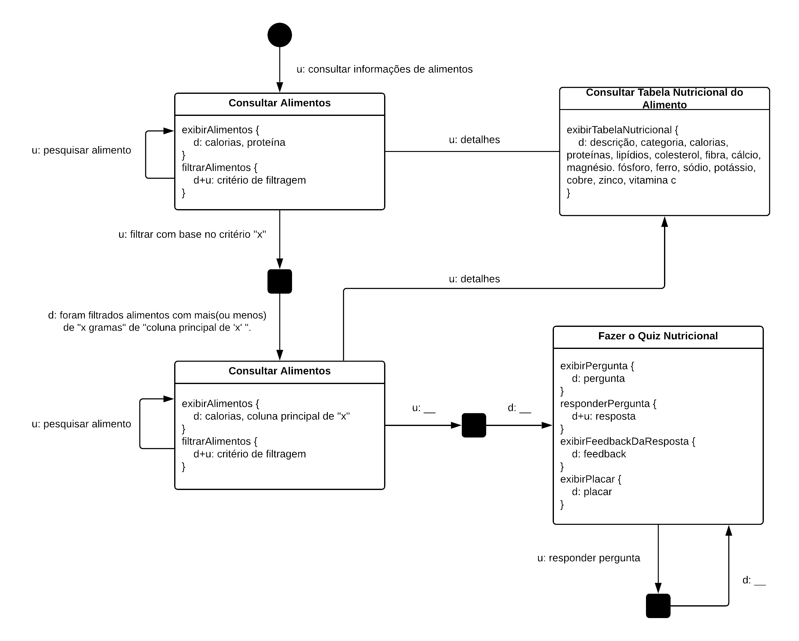

# Artefatos

## Coleta de Dados

Técnicas para coletar os dados relacionados ao usuário e o seu contexto de uso.

###### Questionário

[Google Forms](https://goo.gl/forms/gt6aFQBkBOeKwwuu1)

## Modelo de Interação

São utilizados para modelar a interação humano-computador como uma conversa.

###### MoLIC

